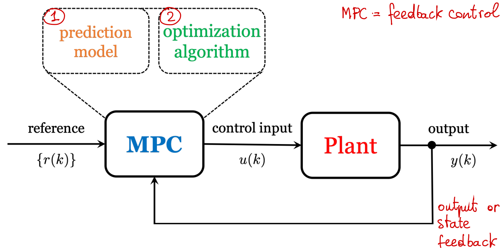
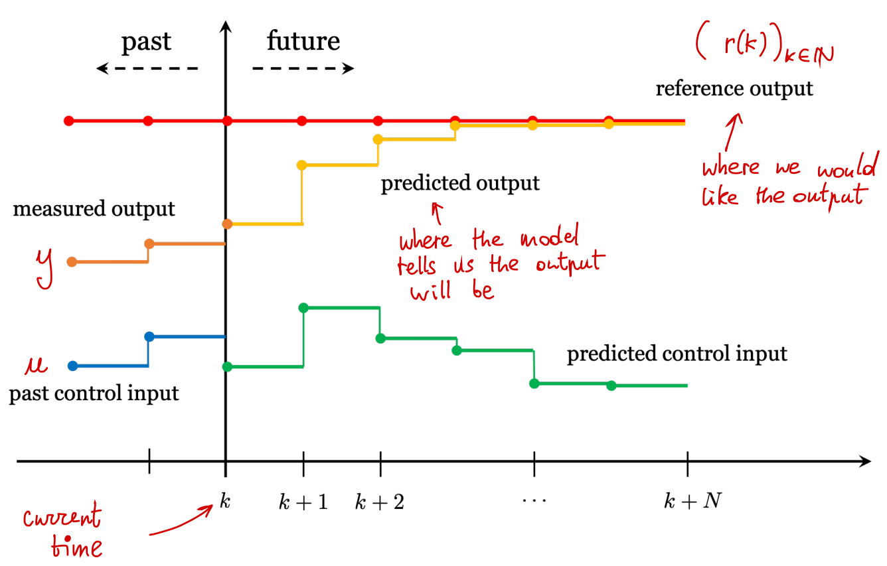
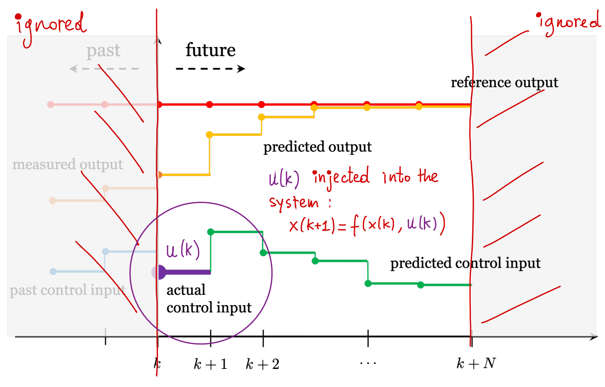
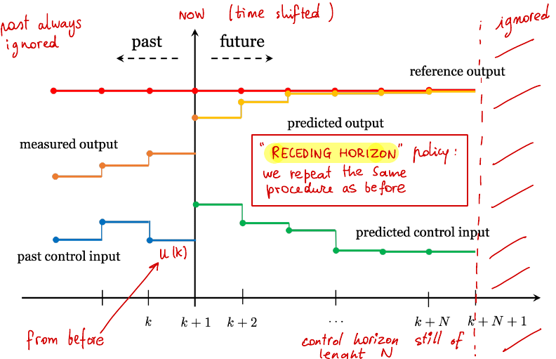
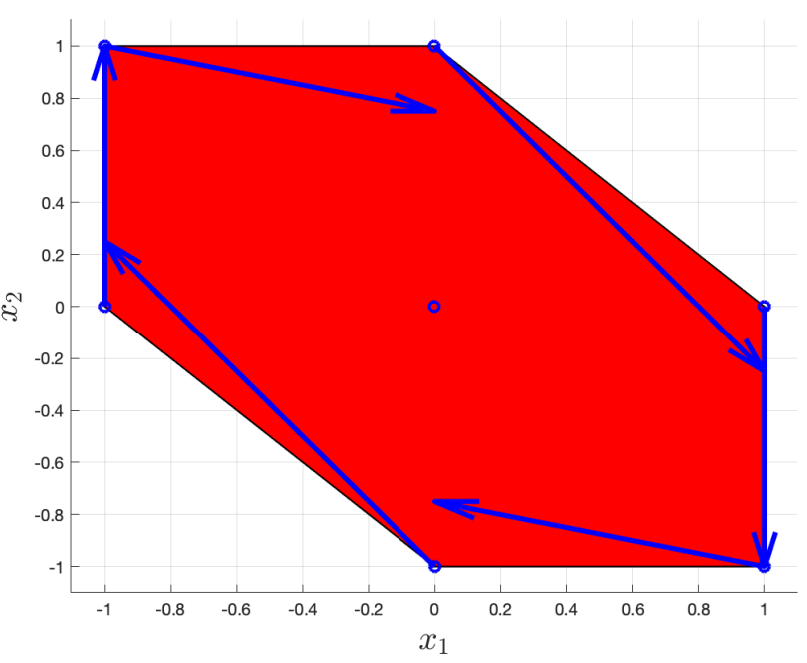
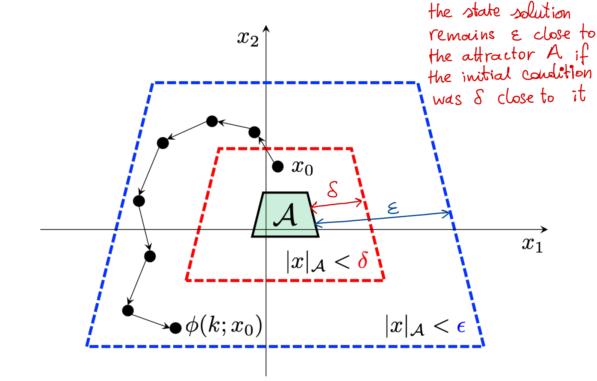

# Lec 1 简介和稳定性理论

本章首先简要的介绍一下本文的主要内容以及一些基本概念，随后提出稳定性理论。本系列主要参考了荷兰代尔夫特理工大学，3mE，Delft Center for Systems and Control，Sergio Grammatico教授开设的硕士课程，模型预测控制（Model Predictive Control or MPC）。

## 目录

- [Lec 1 简介和稳定性理论](#lec-1-简介和稳定性理论)
  - [目录](#目录)
  - [Lec 1.1 简介](#lec-11-简介)
    - [什么是模型预测控制（MPC）？](#什么是模型预测控制mpc)
    - [基础概念：离散动力系统（Discrete-time dynamical systems）](#基础概念离散动力系统discrete-time-dynamical-systems)
    - [简介小结](#简介小结)
  - [Lec 1.2 稳定性理论（Stability Theory）](#lec-12-稳定性理论stability-theory)
    - [离散非线性系统（Discrete-time nonlinear systems）](#离散非线性系统discrete-time-nonlinear-systems)
    - [$\mathcal{K}$ 函数](#mathcalk-函数)
    - [全局渐近稳定性（Global asymptotic stability）](#全局渐近稳定性global-asymptotic-stability)
    - [GAS 和 $\mathcal{KL}$ 函数](#gas-和-mathcalkl-函数)
    - [渐进稳定性（Asymptotic stability）](#渐进稳定性asymptotic-stability)
    - [李雅普诺夫稳定理论（Lyapunov stability theory）](#李雅普诺夫稳定理论lyapunov-stability-theory)
    - [对于线性系统的李雅普诺夫稳定理论](#对于线性系统的李雅普诺夫稳定理论)
    - [对于非线性控制系统的李雅普诺夫稳定理论](#对于非线性控制系统的李雅普诺夫稳定理论)
    - [稳定性理论小结](#稳定性理论小结)
  - [参考](#参考)
    - [常用的MPC软件工具包](#常用的mpc软件工具包)

## Lec 1.1 简介

本节给出了MPC的模糊定义和离散动力系统的基本概念。

### 什么是模型预测控制（MPC）？

模型预测控制主要包括两个部分，第一个部分是预测模型（prediction model），第二个部分是最优化算法（optimization algorithm）。上图中描述了一个使用MPC控制的受控体（Plant）。预测模型的主要作用是预测未来可能发生的情况，而最优化算法可以根据其预测来计算出最优控制输入。

MPC在应用上比较重要的一个思想就是滚动时域策略（Receding horizon policy）。上图描述了一个离散MPC要解决的控制任务，其中我们需要让测量到的输出（measured output）尽可能的贴近参考输出（reference output）。MPC通过预测模型给出了未来的预测输出（predicted output）和可以达到该预测输出的预测（最佳）控制输入（predicted control input）。而滚动时域即限制预测输出的时域范围，从当前时间到正无穷远的时间改为从当前时间到未来某一刻时间（k+N），N即为Horizon。

通过滚动时域这一技巧，最优化问题可以更快的解决。我们将得到的最佳控制输入的第一项作为实际控制输入输入系统之后，系统将会更新。

通过不断地重复以上过程，我们可以不断地使得输出更加贴近参考输出，这就是滚动时域的基本思想。

然后让我们简单的谈一谈一些MPC的实际应用，例如GPS导航应用实时规划最优路径和国际象棋等游戏AI。GPS导航应用在获得你当前的位置后会不断地重新规划最优路径，而我们一般也会执行其给出的建议（最优控制输入）。国际象棋AI（比如说deterministic，即没有随机性）也不断地根据你当前的落子来得到最优解。

工业上的应用则更为广泛，比如最早应用MPC的过程控制 [1]，[2]当时已经可以满足实时性需求；航空航天 [3]， [4] 上通过MPC对能源使用进行优化，实时性已经可以达到秒级；自动驾驶方面也有很多高实时性（0.1s）的应用 [5] - [8]；其他还包括自来水供水 [9]，建筑基于天气情况的安排 [10]，[11]，电网[12]，[13]等。

总的来说，MPC的最主要优点在于其能应对很多不同的约束，并且能保证一定程度的最优性，而且目前已经比较成熟，有充分的应用实例。然而其需要比较精准的控制系统模型，而且需要进行实时运算，在小算力平台上可能导致一些问题。

### 基础概念：离散动力系统（Discrete-time dynamical systems）

形如前文中 $x(k+1)=f(x(k),u(k))$ 的表达即代表离散动力系统的状态空间形式（state space form），

$$
\begin{equation}
\begin{aligned}
x(k+1) &= f(x(k),u(k))\\
y(k) &= h(x(k),u(k))\\
x(0) &= x_{0}\\
\end{aligned}
\end{equation}
$$

一个更简洁的表达将 $x(k+1)$ 写作 $x^+$，

$$
\begin{equation}
\begin{aligned}
x^+ &= f(x,u)\\
y &= h(x,u)\\
x(0) &= x_{0}\\
\end{aligned}
\end{equation}
$$

状态解为 $x(k) = \phi(k; x_0, \bm{u}_k)$，即在时间 $k$ ，初状态为 $x_0$ ，控制输入序列（control input sequence）为 $\bm{u}_k$ 的状态。其中 $\bm{u}_k$ 为，

$$
\bm{u}_k:= (u(0), u(1), \dots, u(k-1))
$$

对于离散线性动力系统（discrete-time linear dynamical systems），状态空间形式可以表达为如下，

$$
\begin{equation}
\begin{aligned}
x^+ &= Ax + Bu\\
y &= Cx + Du\\
\end{aligned}
\end{equation}
$$

状态解为，

$$
\begin{equation}
\begin{aligned}
x(k) &= A^kx_0 + \sum^{k-1}_{j=0}A^{k-j-1}Bu(j)\\
&= A^kx_0 + C_k\bm{u}_k\\
&= \phi(k; x_0, \bm{u}_k)\\
\end{aligned}
\end{equation}
$$

其中 $C_k$ 为k步内控制性矩阵（controllability matrix），$\bm{u}_k$即为上文中的输入控制序列

$$
\begin{equation}
\begin{aligned}
C_k &= [B \quad AB \quad \dots \quad A^{k-1}B]\\
\bm{u}_k &= \begin{bmatrix}
u(k-1) \\
u(k-2) \\
\vdots \\
u(0)
\end{bmatrix}\\
\end{aligned}
\end{equation}
$$

结合以上，MPC可以如下表达，

$$
\begin{equation}
\begin{aligned}
\min_{\boldsymbol{u}_{N}} \quad & V_{N}\left(x_{0}, \boldsymbol{u}_{N}\right)= \sum_{k=0}^{N-1}\{\ell(x(k), u(k))\}+V_{\mathrm{f}}(x(N)) \\
\textrm{subject to} \quad & x(0)=x_{0} \\
& x(k+1)=f(x(k), u(k)), \forall k \\ & (x(k), u(k)) \in \mathbb{Z}, \forall k \\
& x(N) \in \mathbb{X}_{\mathrm{f}}\\
\end{aligned}
\end{equation}
$$

其中 $x(0)$ 为当前（测量）状态，$x(k+1)=f(x(k), u(k))$ 为系统动力学，$(x(k), u(k))\in \mathbb{Z}$ 为系统约束，形如 $Fx(k) + Eu(k) \leq e, \forall k \geq 0$。另外，$V_f$为终端代价（terminal cost），$x(N) \in  \mathbb{X}_{\mathrm{f}}$为终端约束，这二者对于之后进行渐进稳定性分析非常重要。

### 简介小结

最后总结一下，MPC的应用非常广泛，其最主要的三个组成部分为：预测模型、最优化算法以及滚动时域策略。MPC即为有约束最优控制的实现。

## Lec 1.2 稳定性理论（Stability Theory）

本节提出了由李雅普诺夫函数（Lyapunov function）和不变集（invariant set）作为主要内容的稳定性理论。参考书推荐Rawlings等的 [14] 和Khalil的 [15]。

### 离散非线性系统（Discrete-time nonlinear systems）

离散非线性系统可被表达为，

$$
\begin{equation}
\begin{aligned}
x^+ &= f(x)\\
\end{aligned}
\end{equation}
$$

我们假设 $f$ 是局部有界（locally bounded）函数，其平衡点（equilibrium point）为 $x^*=f(x^*)$，正不变集（positive invariant set） $\mathcal{A}$ 可被定义为，

> $\mathcal{A} \subset \mathbb{R^n} \quad \textrm{subject to} \quad f(x) \in \mathcal{A}, \forall x \in \mathcal{A}$

举个例子若 $x^+ = f(x)$ 如下，

$$
\begin{equation}
\begin{aligned}
x^+ &= \begin{bmatrix}
1 & 1\\
-1 & -\frac{1}{4}
\end{bmatrix}x\\
\end{aligned}
\end{equation}
$$

其一个可能的正不变集可以是一个被如下顶点定义的多面体（Polyhedron），

$$
\begin{equation}
\begin{aligned}
\begin{bmatrix}
\pm 1 \\
\mp 1
\end{bmatrix},
\begin{bmatrix}
\pm 1 \\
0
\end{bmatrix},
\begin{bmatrix}
0 \\
\pm 1
\end{bmatrix}\\
\end{aligned}
\end{equation}
$$

如下图所示，该集合中所有点均满足 $x^+$ 也属于该集合，即该集合为此函数的正不变集。蓝线表达了若 $x$ 为顶点 $x^+$ 的变化趋势。

### $\mathcal{K}$ 函数

另外，我们定义 $\mathcal{K}$ 函数如下，

> 若有连续函数 $\sigma: \mathbb{R}_{\geq 0} \rarr \mathbb{R}_{\geq 0}$，
>
> 当 $\sigma(0) = 0$ 且严格递增时，$\sigma$ 为 $\mathcal{K}$ 函数。

我们定义 $\mathcal{K}_{\infty}$ 函数如下，

> 若有连续函数 $\sigma: \mathbb{R}_{\geq 0} \rarr \mathbb{R}_{\geq 0}$，
>
> 当 $\sigma$ 为 $\mathcal{K}$ 函数，且 $\lim_{s \rarr \infty} \sigma(s) = \infty$ （如 $\sigma(s) = |s|$）时，$\sigma$ 为 $\mathcal{K}_{\infty}$ 函数。

我们定义 $\mathcal{KL}$ 函数如下，

> 若有函数 $\beta: \mathbb{R}_{\geq 0} \times \mathbb{N} \rarr \mathbb{R}_{\geq 0}$，
>
> $\forall t \geq 0, \beta(\cdot,t)$ 为 $\mathcal{K}$ 函数；
>
> $\forall s \geq 0, \beta(s, \cdot)$ 不递增且 $\lim_{t \rarr \infty} \beta(s,t) = 0$。
>
> 此时 $\beta(s,t)$ 为 $\mathcal{KL}$ 函数。

最后我们定义正定（$\mathcal{PD}$）如下，

> 若有函数 $\gamma: \mathbb{R}^n \rarr \mathbb{R}_{\geq 0}$，
>
> 当 $\gamma(x) = 0 \Longleftrightarrow x = 0$，$\gamma$ 为正定。

### 全局渐近稳定性（Global asymptotic stability）

若有正不变集 $\mathcal{A}$ 且其封闭，全局渐近稳定性（GAS）定义如下，

> 满足局部稳定性（local stability）：
>
> $\forall \epsilon > 0, \exists \delta > 0 \quad \textrm{subject to} \quad |x|_{\mathcal{A}}<\delta \Longrightarrow |\phi(k;x)|_{\mathcal{A}}<\epsilon, \forall k \in \mathbb{N}$
>
> 满足全局吸引性（global attractivity）：
>
> $\lim_{k \rarr \infty} |\phi(k;x)|_{\mathcal{A}} = 0, \forall x \in \mathbb{R}^n$

直观上的理解，全局渐近稳定性的第一个性质局部稳定性即为当 $|x|_{\mathcal{A}}$，即 $x$ 到 $\mathcal{A}$ 的距离有上界时，其下 $k$ 个状态距离 $\mathcal{A}$ 有上界。第二个性质意味着对于所有可能的状态，其未来的状态会收敛于 $\mathcal{A}$。同样的意思也可以用下图表述。

### GAS 和 $\mathcal{KL}$ 函数

若有正不变集 $\mathcal{A}$ 且其紧密，且 $f$ 连续时，对于 $\mathcal{A}$ 的 GAS 与如下等价，

> $\exist \beta \in \mathcal{KL} \quad \textrm{subject to}$
>
> $|\phi(k;x)|_{\mathcal{A}} \leq \beta(|x|_{\mathcal{A}}, k), \forall k \in \mathbb{N}, x \in \mathbb{R}^n$

这个性质可以理解为，未来可能状态 $x$ 到 $\mathcal{A}$ 的距离由某 $\beta$ 函数（$\mathcal{KL}$ 函数）上限。$\beta$ 函数是状态 $x$ 到 $\mathcal{A}$ 的距离的函数，且随着时间增加而递减。这仍旧意味着 $x$ 到 $\mathcal{A}$ 的距离会收敛到0。

### 渐进稳定性（Asymptotic stability）

由于MPC中有许多约束，我们不太有机会处理GAS，而是分析其非全局渐进稳定性（AS）。类似的，当有正不变集 $\mathcal{X} \subset \mathbb{R}^n$，且有正不变集 $\mathcal{A} \subset \textrm{int}(\mathcal{X})$ 封闭，局部渐进稳定性（locally asymptotically stable）定义为，

> 满足局部稳定性（local stability）：
>
> $\forall \epsilon > 0, \exists \delta > 0 \quad \textrm{subject to} \quad  x \in \big\{ x \in \mathcal{X} \, | \, |x|_{\mathcal{A}}<\delta \big\} \Longrightarrow |\phi(k;x)|_{\mathcal{A}}<\epsilon, \forall k \in \mathbb{N}$
>
> 满足局部吸引性（local attractivity）：
>
> $\exist \eta > 0, \quad \textrm{subject to} \quad  x \in \big\{ x \in \mathcal{X} \, | \, |x|_{\mathcal{A}}<\eta \big\}  \Longrightarrow \lim_{k \rarr \infty} |\phi(k;x)|_{\mathcal{A}} = 0$

渐进稳定性定义（asymptotically stable）为

> 满足局部稳定性（local stability）；
>
> 满足吸引性（attractivity）：
>
> $\lim_{k \rarr \infty} |\phi(k;x)|_{\mathcal{A}} = 0, \forall x \in \mathcal{X}$

注意这里的区别在于吸引性比局部吸引性更宽泛。对于 $\mathcal{A}$ 的 AS 可以定义吸引域（Domain of attraction）为，

> $\big\{ x_0 \in \mathbb{R}^n \, | \, \lim_{k \rarr \infty} |\phi(k;x_0)|_{\mathcal{A}} = 0 \big\}$

即吸引域为所有使得状态 $x$ 渐进稳定于 $\mathcal{A}$ 的初始状态的集合。

### 李雅普诺夫稳定理论（Lyapunov stability theory）

我们定义李雅普诺夫函数（Lyapunov function）如下，

> 假设集合 $\mathcal{A}$ 是系统 $x^+ = f(x)$ 的正不变集，若函数 $V: \mathbb{R}^n \rightarrow \mathbb{R}_{\geq 0}$， $\forall x \in \mathbb{R}^n$ 存在 $\mathcal{K}_\infty$ 函数 $\alpha_1, \alpha_2$，$\mathcal{PD}$ 函数 $\alpha_3$ 满足以下条件
> $$ \alpha_1 (|x|_{\mathcal{A}}) \leq V(x) \leq \alpha_2 (|x|_{\mathcal{A}}) \\
V(f(x)) - V(x) \leq - \alpha_3(|x|_{\mathcal{A}}) $$
> 则函数 $V$ 是李雅普诺夫函数。

则有定理，

> $\exist LF \Longrightarrow GAS$

以及逆定理，

> 若有连续函数 $f$，对于 $\mathcal{A}$ GAS $\Rarr$ $\exist \, smooth \, LF$

若有正不变集 $\mathcal{X} \subseteq \mathbb{R}^n$，且有正不变集 $\mathcal{A} \subset \textrm{int}(\mathcal{X})$ 封闭，则有定理，

> $\exist LF \, \textrm{in} \, \mathcal{X}\Longrightarrow AS$

该定理主要服务于MPC。由于约束存在，$\mathcal{X} \neq \mathbb{R}^n$，故我们需要找到一个李雅普诺夫函数 $V$ 和不变集 $\mathcal{X}$ 来得到渐进稳定性。

### 对于线性系统的李雅普诺夫稳定理论

若有线性系统，

$$
\begin{equation}
\begin{aligned}
x^+ &= Ax\\
\end{aligned}
\end{equation}
$$

则以下几种情况等价，

- 对于 $\big\{ 0 \big\}$ 有GAS

- $|\lambda| < 1, \forall \lambda \in eig(A) \longleftarrow$ 特征值在单位圆内

- $Q \succ 0, \exist P \succ 0, \quad \textrm{subject to} \quad A^TPA-P=-Q$

- $\exist P \succ 0, \quad \textrm{subject to} \quad A^TPA-P \prec 0$

- $\exist P \succ 0, \quad \textrm{subject to} \quad V(x)=x^TPx \, \textrm{is} \, LF$

### 对于非线性控制系统的李雅普诺夫稳定理论

若有非线性控制系统，

$$
\begin{equation}
\begin{aligned}
x^+ &= f(x,u)\\
\end{aligned}
\end{equation}
$$

给定输入约束 $u \in \mathbb{U}$，则定义全局可稳定性（global stabilizability）为，

> $\exist \kappa(\cdot) \quad \textrm{subject to} \quad \mathcal{A} \, \textrm{ GAS } \, for \, x^+=f(x,\kappa(x))$

控制不变集(control invariant set) $\mathcal{A}$ 定义为，

> $\mathcal{A} \subset \mathbb{R^n} \quad \textrm{subject to} \quad \forall x \in \mathcal{A}, \exist u \in \mathbb{U} \quad \textrm{subject to} \quad f(x) \in \mathcal{A}$

即若至少有一个控制输入使得状态保持在 $\mathcal{A}$ 内即称其为控制不变集。

若有控制不变集 $\mathcal{X}, \mathcal{A}$ 且 $\mathcal{A} \subset \mathcal{X}$，我们可以继续定义控制李雅普诺夫函数（control lyapunov function）如下，

> 若函数 $V: \mathbb{R}^n \rightarrow \mathbb{R}_{\geq 0}$， $\forall x \in \mathbb{R}^n$ 存在 $\mathcal{K}_\infty$ 函数 $\alpha_1, \alpha_2$，$\mathcal{PD}$ 函数 $\alpha_3$ 满足以下条件
> $$ \alpha_1 (|x|_{\mathcal{A}}) \leq V(x) \leq \alpha_2 (|x|_{\mathcal{A}}) \\
\inf_{v \in \mathbb{U}} \big\{ V(f(x,v)) \, | \, f(x,v) \in \mathcal{X} \big\} - V(x) \leq - \alpha_3(|x|_{\mathcal{A}}) $$
> 则函数 $V$ 是控制李雅普诺夫函数。

其与李雅普诺夫函数的主要区别就是需要有至少一个控制输入保证其李雅普诺夫函数的递减性。且要求状态 $x$ 一直需要在 $\mathcal{X}$ 内。则有定理，

> $\exist CLF \Longrightarrow$ 全局可稳定性（Global stabilizability）。

定义李雅普诺夫控制法则为，

> $\kappa(x) := \argmin_{v \in \mathbb{U}} \big\{ V(f(x,v)) \, | \, f(x,v) \in \mathcal{X} \big\}$

李雅普诺夫控制法则所获得的 $\kappa(x)$ 即为当前状态 $x$ 下使得 $x+ \in \mathcal{X}$ 时控制李雅普诺夫函数最小的控制输入。

### 稳定性理论小结

本节定义了许多与李雅普诺夫函数相关的概念，其最终目的就是获得控制李雅普诺夫函数的定义，从而在MPC实际应用时可以分析其渐进稳定性。而当李雅普诺夫函数存在时，就意味着渐近稳定性存在，这是本节最重要的结论。而李雅普诺夫函数的存在则意味着李雅普诺夫函数递减且存在不变集。

## 参考

[1] Rafal, Steven, “Discrete dynamic optimization applied to on-line optimal control”, AIChE Journal, 1968.

[2] Qin, Badgwell, “A survey of industrial model predictive control technology”, Control Engineering Practice, 2003

[3] Hegrenaes, Gravdahl, Tondel, “Spacecraft attitude control using explicit model predictive control”, Automatica, 2005

[4] Silani, Lovera, “Magnetic spacecraft attitude control: A survey and some new results”, Control Engineering Practice, 2005

[5] Falcone et al., “Predictive active steering control for autonomous vehicle systems”, IEEE Trans. Control Systems Technology, 2007

[6] Borhan et al., “MPC-based energy management of a power-split hybrid electric vehicle”, IEEE Trans. Control Systems Technology, 2012

[7] Di Cairano et al., “Model predictive idle speed control: Design, analysis, and experimental evaluation”, IEEE Trans. Control Systems Technology, 2012

[8] Di Cairano et al., “Vehicle yaw stability control by coordinated active front steering and di↵erential braking in the tire sideslip angles domain”, IEEE Trans. Control Systems Technology, 2013

[9] Ocampo-Martinez et al., “Hierarchical and decentralised model predictive control of drinking water networks: Application to Barcelona case study”, IET Control Theory & Applications, 2012

[10] Oldewurtel et al., “Use of model predictive control and weather forecasts for energy efficient building climate control", Energy and Buildings, 2012

[11] Sturzenegger et al., “Model predictive climate control of a Swiss office building: Implementation, results, and costbenefit analysis", IEEE Trans. Control Systems Technology, 2013

[12] Parisio, Rikos, Glielmo, “A model predictive control approach to microgrid operation optimization”, IEEE Trans. Control Systems Technology, 2014

[13] Ouammi et al., “Coordinated model predictive-based power flows control in a cooperative network of smart microgrids”, IEEE Trans. Smart Grid, 2015

[14] J. B. Rawlings, D. Q. Mayne, and M. Diehl, “Model predictive control: theory, computation, and design”, Appendix B, 2017

[15] H. K. Khalil, "Nonlinear Systems", Chapter 4, 2002

### 常用的MPC软件工具包

Model Predictive Control (MPC) toolbox (Matlab): mathworks.com/products/mpc

Multi Parametric Toolbox (MPT) (IfA, ETH): mpt3.org

Hybrid Toolbox (IMT): cse.lab.imtlucca.it/~bemporad/hybrid/toolbox

(Interfaces and) Optimization solvers: CVX cvxr.com/cvx (Stanford Univ.); YALMIP yalmip.github.io (Linkoping Univ.); GUROBI gurobi.com
