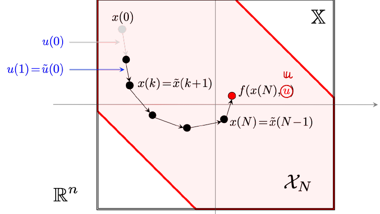

#! https://zhuanlan.zhihu.com/p/506342137

# [MPC] Lec 3 渐进稳定性及证明

> 本系列主要基于荷兰代尔夫特理工大学机械、海事、材料学院（3mE）代尔夫特系统控制中心（Delft Center for Systems and Control），Sergio Grammatico 教授开设的模型预测控制（Model Predictive Control or MPC）硕士课程，由[@人民叫失](https://www.zhihu.com/people/liu-xian-zhong-22-7) [@SailorBrandon](https://www.zhihu.com/people/han-shao-hang-68) [@Rambled](https://www.zhihu.com/people/rambled) [@Smoggy](https://www.zhihu.com/people/smoggy-28) 和 [@苏飞飞](https://www.zhihu.com/people/eee-28-90) 共同整理完成。

本节主要介绍 MPC 的稳定性理论及渐进稳定性的证明。

## 3.1 Recap

对于如下的控制系统

$$
x^{+} = f(x, \kappa(x))
$$

如果在正不变集 $\mathbb{X}$ 上存在一个李雅普诺夫函数 $V$，则系统在 $\mathbb{X}$ 上是渐进稳定的。

> **定义**：**李雅普诺夫函数 (Lyapunov function)**
>
> 假设集合 $\mathcal{A}$ 是系统 $x^+ = f(x)$ 的正不变集，若函数 $V: \mathbb{R}^n \rightarrow \mathbb{R}_{\geq 0}$， $\forall x \in \mathbb{R}^n$ 存在 $\mathcal{K}_\infty$ 函数 $\alpha_1, \alpha_2$，$\mathcal{PD}$ 函数 $\alpha_3$ 满足以下条件
> $$ \alpha_1 (|x|_{\mathcal{A}}) \leq V(x) \leq \alpha_2 (|x|_{\mathcal{A}}) \\
V(f(x)) - V(x) \leq - \alpha_3(|x|_{\mathcal{A}}) $$
> 则函数 $V$ 是李雅普诺夫函数。

在如上定义中提到了正不变集的概念，正不变集的定义如下：
> 如果任意状态 $x \in \mathbb{X}$ 满足 $x^+ = f(x) \in \mathbb{X}$ ，则集合$\mathbb{X}$是正不变集。

通常为了证明系统稳定性，需要证明无限时间阶段最优控制问题 (infinite horizon optimal control) 的代价函数 (cost function)  为李雅普诺夫函数。在 MPC 问题中，通常选取有限时间最优控制问题的代价函数$V_N^0(\cdot)$，证明其满足李雅普诺夫函数的定义，即证明了 MPC 系统的稳定性。下面我们推导无状态约束 (state constraints) 下的 MPC 稳定性的相关结论。

## 3.2 无约束下的稳定性

### 3.2.1 符号说明

在无约束问题中，状态空间为整个 $\mathbb{R}^n$ 空间，即 $\mathbb{X} = \mathbb{R}^n$ 。为了保证在状态空间上的稳定性，要求$k$ 步内能控状态的集合 $\mathcal{X}_k = \mathbb{R}^n$ ，这样系统能够保证在状态空间中任意状态初始化时均能控制到终端约束集合 ( terminal set ) 中。

我们可以使用如下符号表示状态在$x$时步数为 N 的最优控制序列为
$$
\boldsymbol{u}_N^0(x) = (~u_N^0(0;x), ~ u_N^0(1; x),  ~\cdots , ~u_N^0 (N-1; x))
$$
其中$\boldsymbol{u}$ 加粗，代表它是一个序列，下标 $N$ 代表预测步数，上标$0$ 代表该序列为最优控制序列，$u_N^0(k; x)$ 代表最优控制序列的第 $k$ 步输入。

我们用如下符号表示最优控制下的状态序列 $\boldsymbol{x}_N^0(x)$
$$
\boldsymbol{x}_N^0(x) = ( x_{N} ^ {0} (0 ; x) , x_{ N } ^ { 0 } ( 1 ; x ) , \ldots , x_{N} ^ { 0 } ( N ; x ) )
$$
我们用 $x^+$ 表示系统位于状态$x$输入最优控制$u_N^0(0;x)$ 后的下一个状态，即最优状态序列 $\boldsymbol{x}_N^0(x)$的第二个状态（$x _ { N } ^ { 0 } ( 0 ; x )$是第一个状态）
$$
x^+ = f(x, \kappa(x))=  f(x, u_N^0(0;x)) = x_N^0(1;x)
$$
我们需要推导出，在无约束情形下，如果选取$V_N^0(\cdot)$ 为闭环系统的$x^+ = f(x, \kappa(x))$李雅普诺夫函数，需要满足什么样的条件。

### 3.2.2 推导

$V_N^0(\cdot)$ 需满足全局李雅普诺夫函数定义的两个条件，第一个条件很容易证明满足，我们的关注点在第二个条件上，即，
$$
\underbrace { V _{ N } ^ { 0 } ( x ^ { + } ) }_ { ( 1 ) } \leq \underbrace{V _{ N } ^ { 0 } ( x )}_{(2)} - \alpha _{ 3 } ( | x | )
$$
为了辅助证明，需要定义初始状态为$x^+$ 状态下的最优代价函数：
$$
V_ { N } ^ { 0 } ( x ^ { + } ) \stackrel { \text { def. } } { = } V _{ N } ( x ^ { + } , \boldsymbol{u}_ { N } ^ { 0 } ( x ^ { + } ) )
$$
由于最优性，任意改变输入序列第 N 项的输入，$V _{ N } ^ { 0 } ( x ^ { + } )$ 应该是任意输入序列 $\tilde { \boldsymbol u }$ 对应的代价函数$V_ { N } ( x ^ { + }, \tilde{\boldsymbol{u}})$的极小值。这个任意输入序列叫做偏移控制序列 (shifted control sequence)，即只有最后一项输入为控制空间 $\mathbb{U}$ 中的任意输入，而前$N-1$项输入为最优控制序列的输入，
$$
\tilde { \boldsymbol u } = ( u _{ N } ^ { 0 } ( 1 ; x ) , u_ { N } ^ { 0 } ( 2 ; x ) , \ldots , u _{ N } ^ { 0 } ( N - 1 ; x ) , \mathbb { u } )
$$
注意这个输入序列是从$u_ { N } ^ { 0 } ( 1 ; x ) $ 开始的，初始状态是$x^{+}$。对系统输入偏移控制序列后得到状态序列称为偏移状态序列
$$
\tilde { \boldsymbol x } = ( ~ x _{ N } ^ { 0 } ( 1 ; x ) , ~  x_ { N } ^ { 0 } ( 2 ; x ) , ~ \ldots ~  , ~  x _{ N } ^ { 0 } ( N ; x ), ~  f ( x_ { N } ^ { 0 } ( N ; x ) , \mathbb{u} ))
$$

图中 $\mathbb{X}$ 代表状态空间，  $\mathcal{X}_N$ 代表 N 步内能控状态的集合。

因此我们可以得到以下关系
$$
\underbrace { V _{ N } ^ { 0 } ( x ^ { + } ) }_ { ( 1 ) } \leq  \underbrace{V _{ N } ( x ^ { + }, \tilde{\boldsymbol{u}})}_{(3)}
$$
现在我们将 (2) 式展开，它是初始状态为$x$ 时的最优目标函数
$$
(2)= V _{ N } ^ { 0 } ( x ) = \ell ( x , u_ { N } ^ { 0 } ( 0 ; x ) ) + \sum_{k=1}^{N -1} \{ \ell ( x_N^0(k;x), u_N^0(k;x) ) \} + V_ { f } ( x _{ N } ^ { 0 } ( N ; x ) )
$$
然后我们再将 (3) 式展开，它是初始状态为 $x^+$时，前$N-1$ 步最优，第$N$步任意输入下的目标函数
$$
(3) = V_ { N } ( x ^ { + }, \tilde{\boldsymbol{u}}) = \sum _{ k = 1 } ^ { N - 1 } \{ \ell ( x_N^0(k;x), u_N^0(k;x) )  \} + \ell ( x_ { N } ^ { 0 } ( N ; x ) , \mathbb{u} ) +  V _{ f } ( f (  x_ { N } ^ { 0 } ( N ; x ) , \mathbb{u})
$$
通过比较 (2) 式和 (3)，我们发现第 1 步到第 N-1 步的阶段代价（stage cost）是一样的，可以消去，
$$
(3) - (2) =  V _{ f } ( f (  x_ { N } ^ { 0 } ( N ; x ) , \mathbb{u}) + \ell ( x _{ N } ^ { 0 } ( N ; x ) , \mathbb{u} ) - \ell ( x , u_ { N } ^ { 0 } ( 0 ; x ) ) -V _{ f } ( x_ { N } ^ { 0 } ( N ; x ) )
$$
由于已知 $(1)\leq(3)$ ，我们希望 $(3) \leq (2) - \alpha_3(|x|)$ ，即
$$
V _{ f } ( f (  x_ { N } ^ { 0 } ( N ; x ) , \mathbb{u}) + \ell ( x _{ N } ^ { 0 } ( N ; x ) , \mathbb{u} ) - \ell ( x , u_ { N } ^ { 0 } ( 0 ; x ) ) -V _{ f } ( x_ { N } ^ { 0 } ( N ; x ) ) \leq - \alpha_3(|x|)
$$
这里为了简化，我们令$\mathbb{x} = x_N^0(N; x)$ ，表示初时状态为$x$时最优控制下的末状态，整理后上式变为
$$
V _{ f } ( f (  \mathbb{x} , \mathbb{u})) -V_ { f } ( \mathbb{x}) + \ell ( \mathbb{x} , \mathbb{u} )  - \ell ( x , u _{ N } ^ { 0 } ( 0 ; x ) )   + \alpha_3(|x|) \leq 0
$$
从上式得出，$V_N^0(\cdot)$ 是李雅普诺夫函数的两个充分不必要条件分别为
$$
\ell ( x , u_ { N } ^ { 0 } ( 0 ; x ) )  \geq \alpha_3(|x|) \\
V _{ f } ( f (  \mathbb{x} , \mathbb{u})) -V_ { f } ( \mathbb{x}) + \ell ( \mathbb{x} , \mathbb{u} ) \leq 0
$$
前者要求每步的阶段代价 （stage cost） 是正的，后者要求 terminal cost $V_f(\cdot)$ 是在 $\mathbb{X}_f = \mathbb{R}^n$ 上的 [控制李雅普诺夫](https://zh.wikipedia.org/wiki/%E6%8E%A7%E5%88%B6%E6%9D%8E%E4%BA%9E%E6%99%AE%E8%AB%BE%E5%A4%AB%E5%87%BD%E6%95%B8) 函数。

> 注意！
>
> 对于无约束系统， 这里寻找的终端代价 terminal cost 是$\mathbb{R}^n$上的李雅普诺夫函数，该系统也是全局渐进稳定的。显然，MPC 全局渐进稳定的充分条件是存在全局的控制李雅普诺夫函数。但是，假如存在全局的控制李雅普诺夫函数，我们就不必采用 MPC 求解这个问题。我们可以采用 最小化全局控制李雅普诺夫函数 $u^\star = \operatorname{argmin}_u V(f(x, u))$  来找到该问题的最优解。

---

## 3.3 时不变系统的稳定性

对于时不变系统来说，与上节的无约束系统最大的区别是存在时不变的状态约束 $\mathbb{X}$​ 。此时证明系统稳定性不能使用全局李雅普诺夫定义，应该使用笔记1.2节中提到的局部李雅普诺夫函数定义。该部分的推导可以参考 MPC 教材[1]的第2.4节。

为了给出满足状态约束的初始状态 ($x \in \mathbb{X}$​) 稳定的条件，我们借助 terminal set 来推导这个稳定性条件。我们假设存在这样的一个 [控制不变集](https://en.wikipedia.org/wiki/Positively_invariant_set) $\mathbb{X}_f$​，即对于$\forall x \in \mathbb{X}_f$​ 都存在输入 $\exist u \in \mathbb{U}$​ 使得 $f(x, u) \in \mathbb{X}_f$​ ，也就是说，当控系统的状态落入这个集合$\mathbb{X}_f$​后，控制器都存在至少一个输入将系统的状态保留在这个集合中。另外，我们还假定在这个集合中存在局部的控制李雅普诺夫函数$V_f$ ，即
$$
V _{ f } ( f ( x , u ) ) \leq V_ { f } ( x ) - \ell ( x , u )
$$
显然， 初始状态取在这个控制不变集中，控制系统是有稳定性保证的。对于模型预测控制系统，对于给定的初始状态$x$，如果控制器能够在 N 步后将状态控制到这个稳定的控制不变集中，那么这个初始状态就是稳定的 。这些有稳定性保证的初始状态组成的集合是$\mathcal{{X}_N}$。

我们的目的是证明最优代价递减 (optimal cost decrease) ，即最优代价函数为李雅普诺夫函数：
$$
V _{ N } ^ { 0 } ( f ( x , \kappa_ { N } ( x ) ) ) \leq V _{ N } ^ { 0 } ( x ) - \ell ( x , \kappa_ { N } ( x ) ), \quad \forall x \in \mathcal{X}_N
$$
其中$\mathcal{X}_N$是步数为 N 时系统有稳定性保证的初始状态的集合。

**最优代价函数递减**有两种方法证明。一种是类似上节证明无约束代价函数李雅普诺夫递减，构造偏移控制序列，借助控制不变集$\mathbb{X}_f$中存在局部的控制李雅普诺夫函数的假设进行证明。通过这个引理进行证明，需要假定存在最优控制，即$u\in \mathbb{U}$ 的集合$\mathbb{U}$为紧集。这个要求太强了，存在取不到只能趋近最优控制$u^*$ 的情况。另外一种证明方法是先证明最优代价函数单调 (monotonicity of optimal value function)，即
$$
V_ { k + 1 } ^ { 0 } ( x ) \leq V _{ k } ^ { 0 } ( x ) , \quad \forall x \in X_ { k } , \forall k \in \{ 0 , \ldots , N - 1 \} \\
V _{ N } ^ { 0 } ( x ) \leq V_ { f } ( x ) , \quad \forall x \in \mathbb{X} _ { f }
$$
最后得到最优代价函数递减。证明**最优代价函数单调**从 terminal cost $V_f$ 出发，从 0 开始一步步增加步数，并外推出步数为 N 时的代价函数。

下面简单给出证明最优代价函数单调的思路。

### 3.4 由最优代价函数单调性证明最优代价函数递减性

基于前面几节中提到的动态规划思路，我们可以得到如下贝尔曼等式
$$
V _{ 1 } ^ { 0 } ( x ) = \min_ { u \in \mathbb{U}} \{ \ell ( x , u ) + V _{ 0 } ^ { 0 } ( f ( x , u ) ) | f ( x , u ) \in \mathcal{X}_ { 0 } \}
$$
其中$V_0^0(\cdot)$即步数为 0 时的最优代价函数，即 terminal cost $V_f$ ；$\mathcal{X}_0$即步数为 0 时的有稳定性保证的集合，即 terminal set $\mathbb{X}_f$ ，代入上式并利用$V_f$是控制李雅普诺夫函数的假设有
$$
V _{ 1 } ^ { 0 } ( x ) = \min_ { u \in \mathbb{U}} \{ \ell ( x , u ) + V _f( f ( x , u ) ) | f ( x , u ) \in \mathbb{X}_f \} \leq V_f(x)
$$
再对步长为$j$推导，利用$j+1$ 步时$\kappa_{j+1}(x)$ 比 $\kappa_{j}(x)$ 更优（因为预测步数更长了）

$$
\begin{aligned}
V _{ j + 1 } ^ { 0 } ( x ) - V_ { j } ^ { 0 } ( x ) &
= \ell ( x , \kappa _{ j + 1 } ( x ) ) + V_ { j } ^ { 0 } ( f ( x , \kappa _ { j + 1 } ( x ) ) ) - \ell ( x , \kappa _{ j } ( x ) ) - V_ { j - 1 } ^ { 0 } ( f ( x , \kappa _{ j } ( x ) ) ) \quad \forall x \in \mathcal{X}_ { j } \subseteq \mathcal{X} _{ j + 1 } \\
& \leq \ell ( x , \kappa_ { j } ( x ) ) + V _{ j } ^ { 0 } ( f ( x , \kappa_ { j } ( x ) ) ) - \ell ( x , \kappa _{ j } ( x ) ) - V_ { j - 1 } ^ { 0 } ( f ( x , \kappa _{ j } ( x ) ) ) \quad \forall x \in \mathcal{X}_ { j }  \\
& =  V _{ j } ^ { 0 } ( f ( x , \kappa_ { j } ( x ) ) ) - V _{ j - 1 } ^ { 0 } ( f ( x , \kappa_ { j } ( x ) ) )
\end{aligned}
$$

由于递推关系可得到
$$
V_j^0 (x) \leq V_{j -1} ^0 (x), \quad \forall x \in \mathcal{X}_{j-1} \\
V _{ N } ^ { 0 } ( x ) \leq V_ { f } ( x ) , \quad \forall x \in \mathbb{X} _ { f }
$$
最后证明该引理成立。

基于该引理我们可以证明最优代价函数递减，即
$$
 \begin{aligned}
 V _{ N } ^ { 0 } ( x ) = & \ell ( x , \kappa_ { N } ( x ) ) + V _{ N - 1 } ^ { 0 } ( f ( x , \kappa_ { N } ( x ) ) ) \\
 & = \ell ( x , \kappa _{ N } ( x ) ) + V_ { N } ^ { 0 } ( f ( x , \kappa _{ N } ( x ) ) ) +  [ V _ { N - 1 } ^ { 0 } ( f ( x , \kappa _ { N } ( x ) ) ) - V _ { N } ^ { 0 } ( f ( x , \kappa _ { N } ( x ) ) ) ]  \\
& \leq \ell ( x , \kappa_ { N } ( x ) ) + V _{ N } ^ { 0 } ( f ( x , \kappa_ { N } ( x ) ) )
 \end{aligned}
$$

### 稳定性条件

根据以上证明我们可以推出最优代价函数是李雅普诺夫函数的条件为
$$
\begin{aligned}
(1)\quad & f(\cdot), ~\ell, ~V_f ~ \text{continuous}; \quad \mathbb{X} ~ \text{closed}; \quad \mathbb{X}_f \subseteq \mathbb{X} ~ \text{compact}; \\
(2)\quad & \forall x \in X_ { f }, ~ \exists u \in U ~ \text { s.t. }  \quad f ( x , u ) \in X _{ f }, ~ V_ { f } ( f ( x , u ) ) \leq V _{ f } ( x ) - \ell ( x , u ) \\
(3)\quad & \ell ( x , u ) \geq \alpha_ { 1 } ( | x | ) , \quad \forall x \in \mathcal{X} _{ N } , ~ \forall u \in U \\
(4)\quad & 0 \in \operatorname { int } ( X_ { f } ) , \quad V _{ f } ( x ) \leq \alpha_ { 2 } ( | x | ) , \quad \forall x \in \mathbb{X} _{ f }
\end{aligned}{}
$$
由此推出 MPC 稳定渐进，且吸引域为$\mathcal{X}_N$ 。

> 写了这么多，用人话来说很简单：证明 MPC 稳定性的时候，需要检查 terminal cost $V_f$ 是不是李雅普诺夫函数，以及 stage cost $\ell(x, u)$ 是否正定。保证稳定性的具体设计方法以及其他性质的证明，请参照下一章。

---

## 时变系统的稳定性

对于时变模型预测控制系统$x ( t + 1 ) = f ( x , \kappa _{ N } ( x , t ) , t )$的稳定性的证明过程与上面证明相仿，过程更加复杂，但结论相似。其稳定性条件为
$$
\begin{aligned}
(1)\quad & f(\cdot), ~\ell, ~V_f ~ \text{continuous}; \quad \mathbb{X} ~ \text{closed}; \quad \mathbb{X}_f \subseteq \mathbb{X} ~ \text{compact}; \\
(2)\quad & \forall x \in X _{ f }, ~ \exists u \in U ~ \text { s.t. }  \quad f ( x , u ) \in X_ { f }, ~ V _{ f } ( f ( x , u ) ) \leq V_ { f } ( x ) - \ell ( x , u ) \\
(3)\quad & \ell ( x , u , t) \geq \alpha _{ 1 } ( | x | ) , \quad \forall x \in \mathcal{X}_ { N } (t) , ~ \forall u \in \mathbb{U}(t) \\
(4)\quad & V _{ f } ( x ) \leq \alpha_ { 2 } ( | x | ) , \forall x \in \mathbb{X} _{ f }\\
(5)\quad & V_ { N } ^ { 0 } ( x , t ) \leq \alpha ( | x | ) , ~\forall x \in \mathcal{X} _{ N } ( t ) , ~\forall t \in N \\
\end{aligned}{}
$$
由以上条件可以推出最优代价函数是李雅普诺夫函数，即
$$
\left. \begin{array} { l } { \alpha_ { 1 } ( | x | ) \leq V _{ N } ^ { 0 } ( x , t ) \leq \alpha_ { 2 } ( | x | ) } \\
{ V _{ N } ^ { 0 } ( f ( x , \kappa_ { N } ( x , t ) , t ) , t + 1 ) \leq V _{ N } ^ { 0 } ( x , t ) - \alpha_ { 1 } ( | x | ) } \end{array} \right.
$$
即 MPC 渐进稳定，吸引子为 ${0}$ ，吸引域为$\mathcal{X}_N(0)$ 。

参考文献

[1] S. Grammatico, “Lecture 4. model predictive control” 2022
[2]J. B. Rawlings, D. Q. Mayne, and M. Diehl, Model predictive control: theory, computation, and design, 2nd edition. Madison, Wisconsin: Nob Hill Publishing, 2017.
[3] F. Blanchini "Set invariance in control", Automatica, 35(11), 1747–1767, 1999 <https://doi.org/10.1016/S0005-1098(99)00113-2>