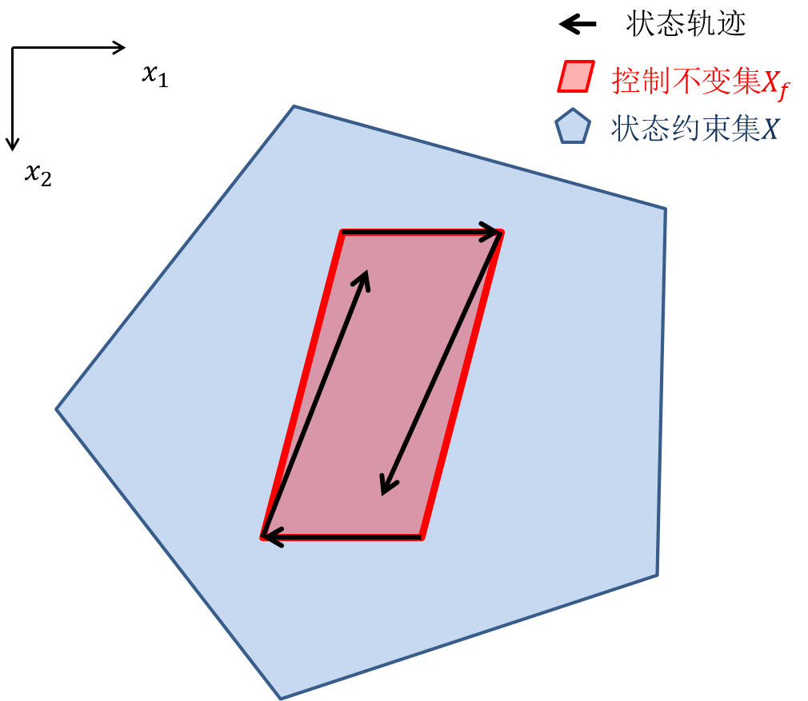

# MPC终端集（Terminal set）的设计
## MPC 终端集$\mathcal{X_f}$的性质
根据之前第二章和第三章的内容，我们了解到了终端集$X_f$的性质。即控制不变性（control invariant）和约束容许性（constraint admissible）。
* 控制不变性（control invariant）
    $$\forall x \in \mathcal{X_f} \ ,\exists u \in \mathcal{U}\ , x^+=f(x,u)\in \mathcal{X_f}$$
    终端集$X_f$中任意状态$x$的下一步$x^+$依然在$X_f$里。表示当状态$x$进入终端集$X_f$后，后续状态不会再离开$X_f$。
* 约束容许性（constraint admissible）
    $$\forall x \in \mathcal{X_f} ,\exists u \in \mathcal{U}, x^+=f(x,u)\in X_f$$
    终端集$X_f$中任意状态$x$的符合状态约束。
下图为一个简单的二维示意图。$X_f$（红色）中所有状态满足状态约束，即包含于蓝色集合$X$。同时状态轨迹保持在$X_f$内。

## 多面体（Polyhedron）终端集 Terminal set as invariant constraint admissible set

## 二次代价函数的水平子集作为终端集 Terminal set as quadratic level set
## 通过增大终端代价函数权重保证
