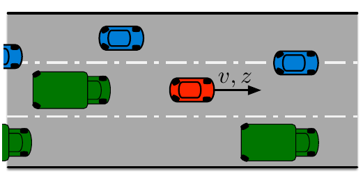

#! https://zhuanlan.zhihu.com/p/506347004
# Lec 6 混合逻辑模型预测控制 (Hybrid Model Predictive Control)

本节介绍基于混合逻辑系统设计模型预测控制器的方法。

**混合逻辑动力系统**(Mixed-Logical-Dynamical systems, MLD system)是指系统动力学$x^+ = f(x, u)$ 中既有连续变量又有逻辑变量的系统。典型的混合逻辑系统可以是由多个连续子系统组成的**分段系统**，每个系统在某些情况下运行；可以是具有**分段线性的输出函数**的线性系统；也可以是**离散输入**（输入为开或者关）。我们以分段系统为例：
$$
x ^ { + } = \left\{ \begin{array} { c l l }{ 0.8 x + u } & \text { if } &{ x \geq 0 }\\{ - 0.8 x + u} & \text { if } & {x < 0 } \end{array} \right.
$$
是由两个连续子系统和逻辑变量组成的混合逻辑系统。对于混合逻辑系统的模型预测控制，我们可以将逻辑规则转化为线性整数不等式，在连续变量中加入逻辑变量后，将混合逻辑关系转化为混合整数线性关系，构建模型预测控制问题，并采用混合整数线性规划（MILP）或者混合整数二次规划（MIQP）的方法进行求解。

## 6.1 MLD系统的转化

考虑如上系统
$$
x ^ { + } = \left\{ \begin{array} { c l l }{ 0.8 x + u } & \text { if } &{ x \geq 0 }\\{ - 0.8 x + u} & \text { if } & {x < 0 } \end{array} \right.
$$
及状态约束$|x| \leq 10$和输入约束 $|u| \leq 10$

考虑布尔变量 $\delta \in \mathbb{B} = \{0, 1\}$ ，我们可以用$\delta$ 是否为真（$\delta = 1$）来表示$x \geq 0$ 是否成立，即构建逻辑关系
$$
[\delta = 1] \Leftrightarrow [x \geq 0]
$$
当 $\delta = 1$ 时，$ x \geq 0$ ； 反之，$x < 0$；我们可以将如上逻辑关系转化为含有 $\delta$ 和$x$的混合整数线性不等式(Mixed-integer linear inequalities)
$$
\left\{ \begin{array} { r } { - m \delta \leq x - m } \\ { - ( M + \varepsilon ) \delta \leq - x - \varepsilon } \end{array} \right.
$$
式中 $m= -10$ ，代表 $x$ 的下界； $M = 10$，代表 $x$ 的上界； $\varepsilon$ 代表一个大于0的很小的量。可以验证，当 $x \geq 0 $且$\delta = 1$  或 当 $x < 0 $且$\delta = 0$ 时，两式同时成立；当 $x < 0 $且$\delta = 1$  或 当 $x \geq 0 $且$\delta = 0$ 时，两式不同时成立。这样，我们就把布尔变量$\delta$ 和混合系统的判断条件构建了联系。

下一步，我们用布尔变量$\delta$ 和原状态改写整个系统的状态方程
$$
x ^ + = (0.8 x + u) \delta + (-0.8 x + u) (1 - \delta) \\
=  1.6x \delta − 0.8x + u
$$
这里有的同学会说改写后的系统的状态方程是一个非线性方程，我们可以借助辅助实变量$z = x \delta$ 来讲状态方程变成线性。但是引入新变量会引入新的约束，这些约束是混合整数不等式，即
$$
\left\{ \begin{array} { l } {z \leq M \delta} \\ { z \geq m \delta } \\ { z \leq x - m ( 1 - \delta ) } \\ { z \geq x - M ( 1 - \delta ) } \end{array} \right.
$$
经过如上推导，我们得到了等价的状态方程及约束为：
$$
x^+ = 1.6 z - 0.8 x + u \\
\text{subject to} \left\{ \begin{array} { l } {|x| \leq 10} \\ { |u| \leq 10} \\{ - m \delta \leq x - m } \\ { - ( M + \varepsilon ) \delta \leq - x - \varepsilon } \\ {z \leq M \delta} \\ { z \geq m \delta } \\ { z \leq x - m ( 1 - \delta ) } \\ { z \geq x - M ( 1 - \delta ) } \end{array} \right.
$$

关于如何将逻辑关系$[ \delta = 1 ] \Leftrightarrow [ f ( x ) \geq c ]$ 转换为等价的混合整数线性不等式，这里给出一个转换表格

| 逻辑关系                                                     | 混合整数线性不等式 (MIL inequalities)                        |
| ------------------------------------------------------------ | ------------------------------------------------------------ |
| $[ \delta = 1 ] \Leftrightarrow [ f ( x ) \geq c ]$          | $\left\{ \begin{array} { l } { ( c - m ) \delta \leq f ( x ) - m } \\ { ( M - c + \epsilon ) \delta \geq f ( x ) - c + \epsilon } \end{array} \right.$ |
| $[ \delta = 1 ] \Leftrightarrow [ f ( x ) \leq c ]$          | $\left\{ \begin{array} { l } { ( M - c ) \delta \leq M - f ( x ) } \\ { ( c + \epsilon - m ) \delta \geq \epsilon + c - f ( x ) } \end{array} \right.$ |
| $[ \delta = 1 ] \Leftrightarrow [ \sigma = 1 ] \wedge [ \gamma = 1 ]$ | $\left\{ \begin{array} { l } { - \sigma + \delta \leq 0 } \\ { - \gamma + \delta \leq 0 } \\ { \sigma + \gamma - \delta \leq 1 } \end{array} \right.$ |
| $[ \delta = 1 ] \Leftrightarrow [ \sigma = 1 ] \vee [ \gamma = 1 ]$ | $\left\{ \begin{array} { c } { \sigma - \delta \leq 0 } \\ { \gamma - \delta \leq 0 } \\ { - \sigma - \gamma + \delta \leq 0 } \end{array} \right.$ |
| $[ \delta = 0 ] \Rightarrow [ g = 0 ] , [ \delta = 1 ] \Rightarrow [ g = f ( x ) ]$ | $\left\{ \begin{array} { l } { m \delta \leq g \leq M \delta } \\ { - M ( 1 - \delta ) \leq g - f ( x ) \leq - m ( 1 - \delta ) } \end{array} \right.$ |

一般来说，混合逻辑动力系统 MLD 的模型可以写成如下形式
$$
\left\{ \begin{array} { l }{ x ^ { + } = A x + B _{ 1 } u + B_ { 2 } \delta + B _{ 3 } z }\\{ y = C x + D_ { 1 } u + D _{ 2 } \delta + D_ { 3 } z } \end{array} \right. \\
\text{subject to} \left\{ \begin{array}{l} { E _{ 2 } \delta + E_ { 3 } z \leq E _{ 4 } x + E_ { 1 } u + E _{ 5 } } \\ {G x_ { c } + H u _{ c } + \psi \leq 0}\end{array} \right. \\
\text{where} \left\{ \begin{array}{l} {x = \left[ \begin{array} { l } { x _ { c } } \\ { x _ { d } } \end{array} \right] \in \mathbb{R} ^  { n_ { c } } \times \mathbb{B} ^  { n _{ d } }} \\ {u = \left[ \begin{array} { l } { u _ { c } } \\ { u _ { d } } \end{array} \right] \in \mathbb{R} ^  { m_ { c } } \times \mathbb{B} ^  { m _{ d } }} \\ {y = \left[ \begin{array} { l } { y _ { c } } \\ { y _ { d } } \end{array} \right] \in \mathbb{R} ^  { p_ { c } } \times \mathbb{B} ^  { p _{ d } }} \\ {\delta \in \mathbb{B} ^  { r_ { d } } , z \in \mathbb{R} ^  { r _ { c } }} \end{array} \right.
$$

## 6.2 MPC 设计

理论上来说，我们可以把混合系统的模型预测控制问题转化后写成如下形式

$$
\left. \begin{array} { l l } { \min_ { x _ { N } , u _ { N } , \delta _ { N } , z _ { N } } } & { V _ { N } ( x _ { 0 } , u _ { N } ) = \sum _ { k = 0 } ^ { N - 1 } \{ \ell ( x ( k ) , u ( k ) ) \} } \\ { \text { s.t. } } & { x ( k + 1 ) = A x ( k ) + B _ { 1 } u ( k ) + B _ { 2 } \delta ( k ) + B _ { 3 } z ( k ) , \forall k } \\ { } & { E _ { 2 } \delta ( k ) + E _ { 3 } z ( k ) \leq E _ { 4 } x ( k ) + E _ { 1 } u ( k ) + E _ { 5 } , \forall k } \\ { } & { x _ { 0 } = x ( 0 ) . } \end{array} \right.
$$

式中的 $\delta(k)$ 是布尔变量，$z ( k )$是实变量。该问题的状态方程为

$$
x ( k ) = \phi ( k ; x _ { 0 } , u _ { k } , \delta _ { k } , z _ { k } ) = A ^ { k } x _ { 0 } + C _ { k } u _ { k } + C _ { k } ^ { \delta } \delta _ { k } + C _ { k } ^ { z } z _ { k }
$$

其中

$$
C _ { k } ^ { \delta } : = \left[ \begin{array} { l l l l } { B _ { 2 } } & { A B _ { 2 } } & { \cdots } & { A ^ { k - 1 } B _ { 2 } } \end{array} \right] , C _ { k } ^ { z } : = \left[ \begin{array} { l l l l } { B _ { 3 } } & { A B _ { 3 } } & { \cdots } & { A ^ { k - 1 } B _ { 3 } } \end{array} \right] .
$$

若 stage cost 为二次形式，且满足 Q 半正定、R正定，即
$$
\ell ( x , u ) = \frac { 1 } { 2 } ( x ^ { T } Q x + u ^ { T } R u ) , Q \succcurlyeq 0 , R \succ 0
$$

则以上问题可以整理成如下形式的成 MIQP 问题
$$
\mathbb{P} _ { N } ( x _ { 0 } ) : \left\{ \begin{array} { l l } { \min _ { \xi _ { N } } } & { \frac { 1 } { 2 } \xi _ { N } ^ { T } H \xi _ { N } + x _ { 0 } ^ { T } F \xi _ { N } } \\ { \text { s.t. } } & { G \xi _ { N } \leq W + S x _ { 0 } } \end{array} \right.
$$

其中的 $\xi _ { N }$ 包含了输入 $u$ 、布尔变量 $\delta(k)$和实变量$z ( k )$

$$
\xi _ { N } = [ \underbrace { u ( 0 ) , \ldots , u ( N - 1 ) } _ { \text { mixed-integer } } , \underbrace { \delta ( 0 ) , \ldots , \delta ( N - 1 ) } _ { \text { binary } } , \underbrace { z ( 0 ) , \ldots , z ( N - 1 ) } _ { \text { real } } ] ^ { T }
$$

稳定性

- $x ( 0 ) = x _ { 0 }$ 使得 MIQP 在 $k = 0$ 时有可行解
- 存在终端约束 $x(N) = x_{\text{ref}}$

则 $\{x_{\text{ref}}\}$ 闭环系统渐进稳定

## 6.3 工程应用

实际工程中的大部分问题都可以建模成混合系统进行求解。例如，下面多车道车速安全控制问题即可使用混合系统的MPC求解。

图中的红车是受控对象。我们可以控制的有车速和车道。车速是连续变量。车道是离散的变量，取值范围是 $\mathbb{L} = \{ 1 , \ldots , L \}$ ，其中 $L$ 是车道总数。红车每次只能向相邻车道变道。该问题可以建模成如下MPC问题

$$
\left\{ \begin{array} { l l } { \min _ { v , z } } & { V _ { N } ( v , z ) } \\ { \text { s.t. } } & { 0 \leq v ( k ) \leq \overline { v } , \forall k \in T } \\ { } & { \max \{ 1 , z ( k ) - 1 \} \leq z _ { i } ( k + 1 ) \leq \min \{ L , z ( k ) + 1 \} , \forall k \in T } \end{array} \right.
$$

其中 $T : = \{ 0,1 , \ldots , N \}$ 是预测步长的集合。

为了保证红车能够在车道上安全行驶，定义红车与第 $j$ 个小车的纵向距离和侧向距离分别为
$$
d _ { j } ( k + 1 ) = d _ { j } ( k ) + \tau ( v _ { j } ( k ) - v ( k ) ) , \quad \forall j , \forall k \in T \\
\Delta z _ { j } ( k ) = z _ { j } ( k ) - z ( k ) \in \{ \underbrace { - L + 1 } _ { m _ { \Delta } } , \underbrace { L - 1 } _ { M _ { \Delta } } \} , \quad \forall j , \forall k \in T
$$
安全性条件为：若红车与其它车在同一车道，则两车之间距离要大于安全距离 $ \overline { d }$。该条件用逻辑关系表示为
$$
\underbrace { [ \Delta z _ { j } ( k ) = 0 ] } _ { (A) } \Rightarrow \underbrace { [ d _ { j } ( k ) \geq \overline { d } ] } _ { (B) } \quad \forall j , \forall k \in T
$$
由于逻辑关系(A)中的变量 $\Delta z _ { j } ( k )$ 不是布尔变量，我们需要把这个逻辑关系用布尔变量表示，这里可以定义辅助变量 $\alpha_j$ 
$$
\underbrace { [ \alpha _ { j } ( k ) = 1 ] } _ { (A _ { 3 }) } \Leftrightarrow \underbrace { [ \Delta z _ { j } ( k ) \leq 0 ] } _ { (A _ { 1 }) } \wedge \underbrace { [ \Delta z _ { j } ( k ) \geq 0 ] } _ {( A _ { 2 }) }
$$
将如上关系按照 6.1 节中方法将上面三项分别转化为混合整数不等式为
$$
(A _ { 1 }) : \left\{ \begin{array} { l } { M _ { \Delta } \theta _ { j } ( k ) \leq M _ { \Delta } - \Delta z _ { j } ( k ) } \\ { ( \epsilon - m _ { \Delta } ) \theta _ { j } ( k ) \geq \epsilon - \Delta z _ { j } ( k ) } \end{array} \right. \\
(A _ { 2 }) : \left\{ \begin{array} { l } { - m _ { \Delta } \kappa _ { j } ( k ) \leq \Delta z _ { j } ( k ) - m _ { \Delta } } \\ { ( M _ { \Delta } + \epsilon ) \kappa _ { j } ( k ) \geq \epsilon + \Delta z _ { j } ( k ) } \end{array} \right. \\
(A _ { 3 }) : \left\{ \begin{array} { l } { - \theta _ { j } ( k ) + \alpha _ { j } ( k ) \leq 0 } \\ { - \kappa _ { j } ( k ) + \alpha _ { j } ( k ) \leq 0 } \\ { \theta _ { j } ( k ) + \kappa _ { j } ( k ) - \alpha _ { j } ( k ) \leq 1 } \end{array} \right.
$$

加入辅助布尔变量 $\alpha_j$ 后安全性条件可以改写为
$$
\alpha _ { j } ( k ) ( - d _ { j } ( k ) + \overline { d } ) \leq 0
$$
这时我们发现这个不等式是一个非线性约束，我们可以定义新的辅助实变量 $f _ { j } = \alpha _ { j } d _ { j } \in \mathbb{R}$ ，它需要满足如下条件
$$
(B): \left\{ \begin{array} { l } { d _ { \min } \alpha _ { j } \leq f _ { j } \leq d _ { \max } \alpha _ { j } } \\ { - d _ { \max } ( 1 - \alpha _ { j } ) \leq f _ { j } - d _ { j } \leq - d _ { \min } ( 1 - \alpha _ { j } ) } \end{array} \right.
$$
最后改写安全性条件为
$$
\alpha _ { j } ( k ) \overline { d } - f _ { j } ( k ) \leq 0
$$

综合以上混合整数线性约束，我们得到如下MPC问题
$$
\left\{ \begin{array} { c l } { \min _ { v , z , \alpha , f , \theta , \kappa } } & { V _ { N } ( v , z ) } \\ { \text { s.t. } } & { 0 \leq v ( k ) \leq \overline { v } , \quad \forall k \in T } \\ { } & { z ( k + 1 ) \leq \min \{ L , z ( k ) + 1 \} , \quad\forall k \in T } \\ { } & { - z ( k + 1 ) \leq - \max \{ 1 , z ( k ) - 1 \} ,\quad  \forall k \in T } \\ 
{ } & { (A _ { 1 }), \quad \forall j , \forall k \in T } \\
{ } & { (A _ { 2 }), \quad \forall j , \forall k \in T } \\ 
{ } & {  (A _ { 3 }), \quad \forall j , \forall k \in T } \\ 
{ } & {  (B ) , \quad \forall j , \forall k \in T } \\ 
{ } & { - f _ { j } ( k ) + \alpha _ { j } ( k ) \overline { d } \leq 0 , \quad \forall j , \forall k \in T } \end{array} \right.
$$

求解该 MPC 即可实现红车的车道车速安全控制。